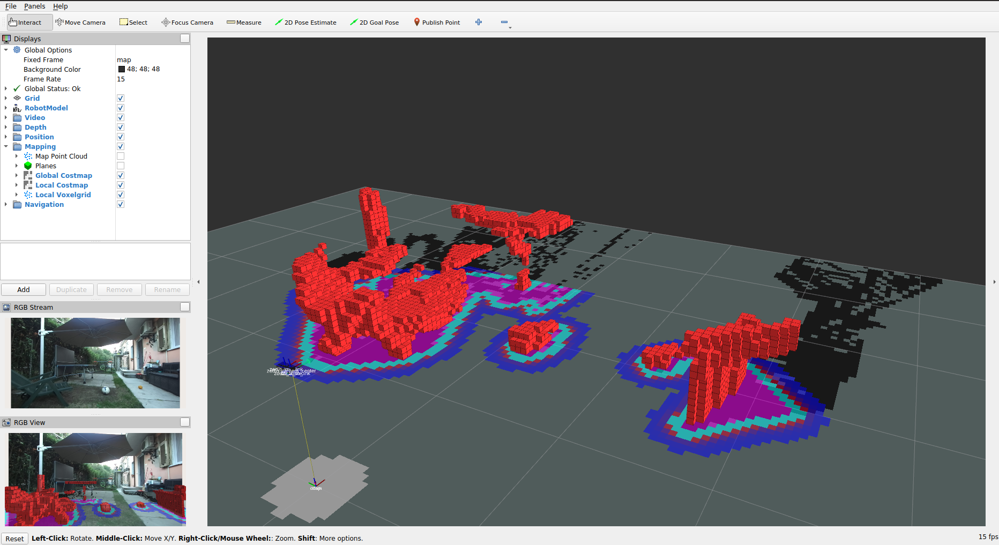

# Nav2 2D Cost Map example

This example demonstrates how to configure the Nav2 package to generate a 2D cost map for robot navigation by using the point cloud published by the ZED ROS2 node and the Spatio Temporal Voxel Layer (STVL) plugin.

## Run the example

A launch file is provided to start the example in the default configuration:

`$ ros2 launch zed_costmap2d_example start_example.launch.py`

The launch file will start the ZED Node configured for a ZED2i camera, the Nav2 infrstructure in SLAM mode, and finally Rviz2 pre-configured for data visualization.

### Launch options

Run the command 

`$ ros2 launch zed_costmap2d_example start_example.launch.py -s`

for the list of all the available launch file options:

* `svo_path`: full path to a SVO file to be used as input instead of a live camera.
* `cam_pos_x`, `cam_pos_y`, `cam_pos_z`: X, Y, and Z coordinates of the camera with respect to the robot `base_link`. **Note**: by default the parameter `pos_tracking.floor_alignment` in `params/custom_common.yaml` is set to `true`, so the `cam_pos_z` value is ignored being automatically estimated by the node - Default: `0.0`.
* `cam_roll`, `cam_pitch`, `cam_yaw`: Roll, Pitch, and Yaw angles of the camera with respect to the robot `base_link` - Default: `0.0`.
* `nav2_params_file`: full path to the parameters file to use for all launched Nav2 nodes - Default: `params/nav2_custom_params.yaml`.
* `default_bt_xml_filename`: full path to the behavior tree xml file to use - Default: `nav2_bt_navigator/behavior_trees/navigate_w_replanning_distance.xml`.

## Configuration

You can configure the example to best fit the configuration of the test rig.

### Camera position

If the height of the camera from the floor is unknown, you can automatically estimate if by setting 
`pos_tracking.floor_alignment` to `true` in the file `params/custom_common.yaml`.

Note that a wide range of the floor must be visible, otherwise the ZED positional tracking module will be stuck searching for a valid initial position.

### Point cloud range 

You can change the maximum and minimum range for the point cloud:

* `depth.min_depth` in `params/custom_zed2i.yaml`
* `depth.max_depth` in `params/custom_zed2i.yaml`

Note that the Nav2 configuration must match this values:

* `global_costmap.obstacle_layer.pointcloud.obstacle_min_range` in `params/nav2_custom_params.yaml`
* `global_costmap.obstacle_layer.pointcloud.obstacle_max_range` in `params/nav2_custom_params.yaml`
* `global_costmap.obstacle_layer.pointcloud.raytrace_min_range` in `params/nav2_custom_params.yaml`
* `global_costmap.obstacle_layer.pointcloud.raytrace_max_range` in `params/nav2_custom_params.yaml`
* `global_costmap.obstacle_layer.pointcloud.stvl_layer.obstacle_range` in `params/nav2_custom_params.yaml` [if enabled]
* `local_costmap.width` in `params/nav2_custom_params.yaml`
* `local_costmap.height` in `params/nav2_custom_params.yaml`
* `local_costmap.stvl_layer.pointcloud.obstacle_range` in `params/nav2_custom_params.yaml`

### Point cloud frequency

You can change the frequency of the point cloud to reduce elaboration cost:

* `depth.point_cloud_freq` in `params/custom_zed2i.yaml`

Note that the Nav2 configuration must match this values:

* `local_costmap.update_frequency` in `params/nav2_custom_params.yaml`
* `local_costmap.publish_frequency` in `params/nav2_custom_params.yaml`

### Robot dimensions

It is important to correctly set the dimensions of the robot to generate consistent maps:

* `global_costmap.robot_radius` in `params/nav2_custom_params.yaml`
* `global_costmap.obstacle_layer.pointcloud.min_obstacle_height` in `params/nav2_custom_params.yaml`
* `global_costmap.obstacle_layer.pointcloud.max_obstacle_height` in `params/nav2_custom_params.yaml`
* `global_costmap.stvl_layer.pointcloud.min_obstacle_height` in `params/nav2_custom_params.yaml` [if enabled]
* `global_costmap.stvl_layer.pointcloud.max_obstacle_height` in `params/nav2_custom_params.yaml` [if enabled]
* `local_costmap.stvl_layer.pointcloud.min_obstacle_height` in `params/nav2_custom_params.yaml` 
* `local_costmap.stvl_layer.pointcloud.max_obstacle_height` in `params/nav2_custom_params.yaml` 

