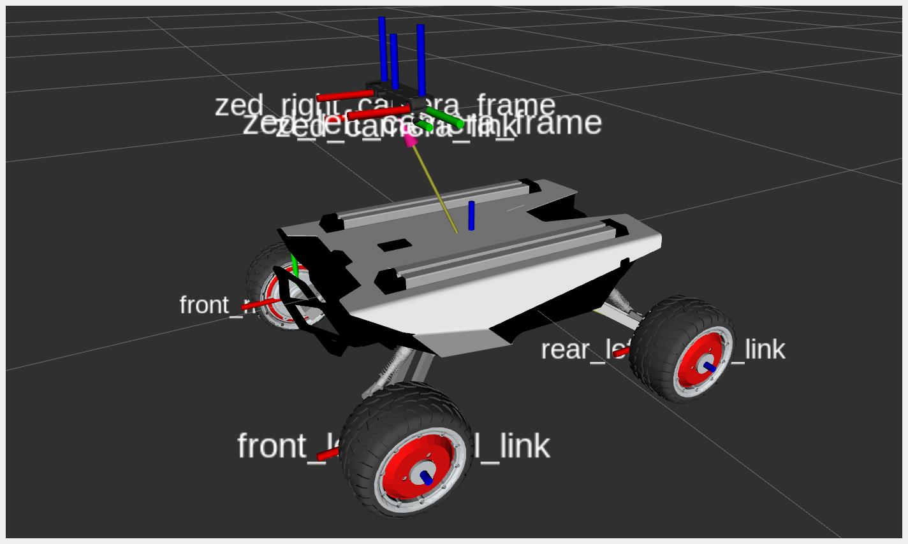
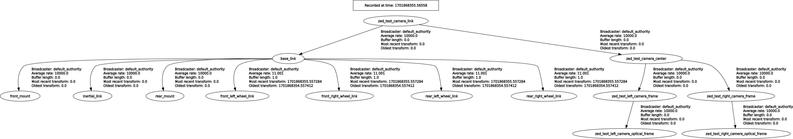
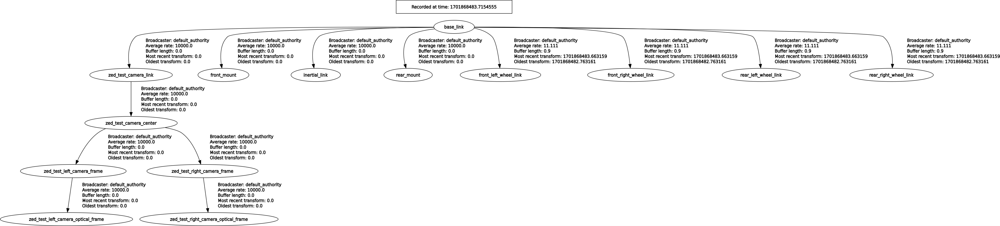
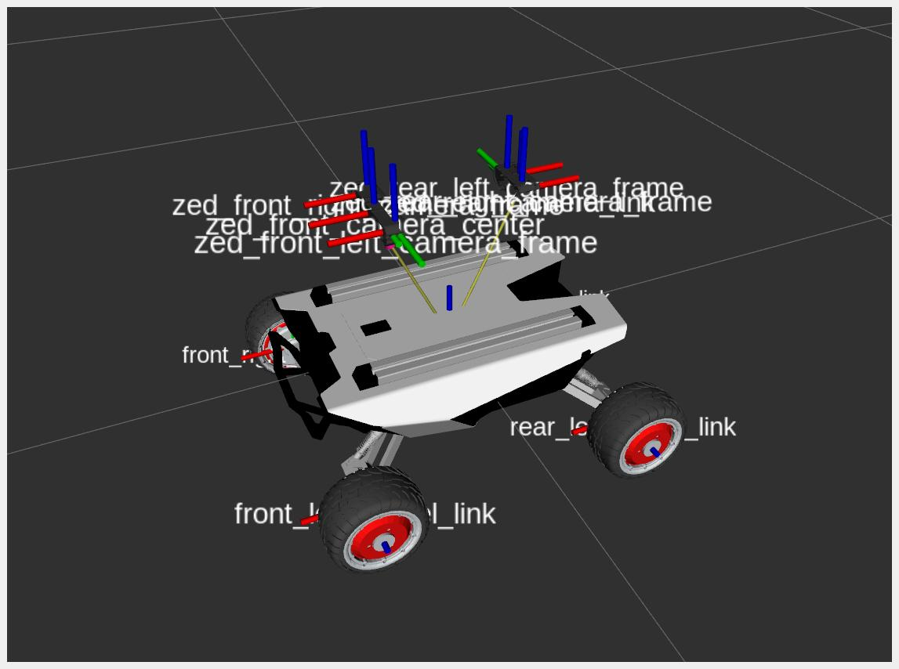
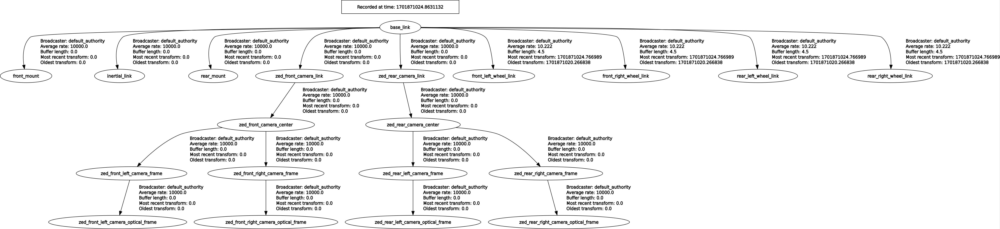

# Tutorial - Robot integration

This tutorial explains how to use the [xacro](https://index.ros.org/p/xacro/) tool to add the ZED camera to the URDF of a robot.

There are two different configurations to use when adding a ZED to a robot, which one to select depends on how you plan to localize the robot in the map:

1. Localize the robot by using exclusively the ZED Positional Tracking 
2. Localize the robot by using the ROS 2 tools (e.g. the [Robot Localization](https://index.ros.org/p/robot_localization/github-cra-ros-pkg-robot_localization/) package) to fuse different sources of odometry and pose estimation.

## Install the dependencies

For the scope of this tutorial we use the [AgileX Scout Mini](https://www.agilex.ai/chassis/11) 4WD robot as a reference, but the explained concepts apply to all the robots in the same way.

You can install the required packages by using the following commands:

```bash
cd <ros2_workspace>/src
git clone https://github.com/stereolabs/scout_ros2.git
git clone https://github.com/westonrobot/ugv_sdk.git
git clone https://github.com/westonrobot/async_port.git
cd ..
sudo apt update
rosdep install --from-paths src --ignore-src -r -y # install dependencies
colcon build --symlink-install --cmake-args=-DCMAKE_BUILD_TYPE=Release --parallel-workers $(nproc) # build the workspace
source ~/.bashrc
```

## Create the URDF file by using xacro

[xacro](https://docs.ros.org/en/humble/Tutorials/Intermediate/URDF/Using-Xacro-to-Clean-Up-a-URDF-File.html) is an XML macro language. With xacro, you can construct shorter and more readable XML files by using macros that expand to larger XML expressions.

With xacro you can use parameters, variables, constants, and apply math formulas to customize the URDF model of the robot according to the used configuration.

The tutorial propose two different configurations:

* **mono-camera**: how to add a single ZED camera to the robot
* **multi-camera**: how to add multiple ZED cameras to the robot. The tutorials explains how to create a dual-camera configuration, but it can be generalized for N cameras.

## Mono-Camera Configuration

The xacro file `urdf/zed_robot_mono.urdf.xacro` defines the robot configuration to obtain the result in the following picture.



### Set the parameters

Three xacro arguments are defined at the very beginning of the example `xacro` file:

```xml
  <xacro:arg name="camera_name"   default="zed" />
  <xacro:arg name="camera_model"  default="zed" />
  <xacro:arg name="use_zed_localization" default="true" />
  ```

* `camera_name`: sets the name of the camera to be used as prefix for the names of the link and joint of the camera URDF model.
* `camera_model`: sets the model of the camera to correctly load the visual 3D model and set dimensions and the biases for the mounting points.
* `use_zed_localization`: allows to set the correct TF tree in case ZED Localization is used as the main localization engine, or an external localization engine (e.g. the [Robot Localization](https://index.ros.org/p/robot_localization/github-cra-ros-pkg-robot_localization/) package) is used.

### Add a Robot model

First of all the URDF must contain the description of the robot. In the example we import the `scout_mini.xacro` file from the `scout_description` package. We provide this file in the GitHub repository [scout_ros2](https://github.com/stereolabs/scout_ros2) that is a fork of the original repository containing customizations and fixes.

```xml
  <xacro:include filename="$(find scout_description)/urdf/scout_mini.xacro" />
```

The file `scout_mini.xacro` defines a link called `base_link` that will be the reference link to place the camera on the robot.
You can use other links as a reference, but it's important that you respect the conventions explained in the next section.

### Add a ZED Camera

To use a ZED camera we must include the `xacro` file that describes the ZED camera static links and joints available in the `zed_wrapper` package of the [zed-ros2-wrapper](https://github.com/stereolabs/zed-ros2-wrapper/tree/master/zed_wrapper) repository.

```xml
  <xacro:include filename="$(find zed_wrapper)/urdf/zed_macro.urdf.xacro" />
```

Next we can add one ZED camera of type `camera_model` with name `camera_name` defined by the correspondent xacro arguments:

```xml
  <xacro:zed_camera name="$(arg camera_name)" model="$(arg camera_model)" />
```

### Add a joint to the URDF to place the ZED Camera on the Robot

This is the most important part of the `xacro` file. Here we can connect the camera to the robot and define its position and orientation.

The ZED URDF defines a reference link called `<camera_name>_camera_link`. This is the link to connect the camera to an existing Robot URDF.

The most common way to place the camera on the robot is to add a joint that connects `<camera_name>_camera_link` to the `base_link` frame of the robot. This is not mandatory, you can connect the camera to each link of the robot. In any case, it is important that the TF chain `map` -> `odom` -> `[...]` -> `<camera_name>_camera_link` is not broken (see [REP 105](https://www.ros.org/reps/rep-0105.html) as a reference).

There is an important thing to be taken into consideration: if you use the ZED Positional Tracking module and you set `pos_tracking.publish_tf` to `true`, then the `<camera_name>_camera_link` must be the root frame of the robot to correctly localize it on the map.

The following part of the `zed_robot_mono.urdf.xacro` create the joint according to the value of the argument `use_zed_localization`:

```xml
  <!-- Add a joint to connect the ZED Camera to the robot -->
  <xacro:if value="$(arg use_zed_localization)">
    <!-- ZED Localization -> The reference link is '$(arg camera_name)_camera_link' and 'base_link' is a child -->
    <joint name="$(arg camera_name)_joint" type="fixed">
      <parent link="$(arg camera_name)_camera_link"/>
      <child link="base_link"/>
      <origin
        xyz="-0.12 0.0 -0.25"
        rpy="0 0 0"
      />
    </joint>
  </xacro:if>
  <xacro:unless value="$(arg use_zed_localization)">
    <!-- NO ZED Localization -> '$(arg camera_name)_camera_link' is a child of 'base_link' -->
    <joint name="$(arg camera_name)_joint" type="fixed">
      <parent link="base_link"/>
      <child link="$(arg camera_name)_camera_link"/>
      <origin
        xyz="0.12 0.0 0.25"
        rpy="0 0 0"
      />
    </joint>
  </xacro:unless>
```

If the parameter `use_zed_localization` is `true`, then the frame `<camera_name>_camera_link` is the parent link, while `base_link` is the child, and the `origin` transform reflects this convention.

This is the TF tree generated when `use_zed_localization` is enabled:


If the parameter `use_zed_localization` is `false`, then the frame `base_link` is the parent link, while `<camera_name>_camera_link` is the child, and the `origin` transform is the inverse with respect to the previous condition.

This is the TF tree generated when `use_zed_localization` is disabled:


## Multi-Camera Configuration

The xacro file `urdf/zed_robot_dual.urdf.xacro` defines the robot configuration to obtain the result of the following picture in a dual-camera configuration.



The explained concepts can be generalized for N cameras.

### Set the parameters

Three xacro arguments are defined at the very beginning of the example `xacro` file.

It is required to specify the name and the model for each camera installed on the robot:

```xml
  <xacro:arg name="camera_name_1"   default="zed_front" />
  <xacro:arg name="camera_name_2"   default="zed_back" />
  <xacro:arg name="camera_model_1"  default="zedx" />
  <xacro:arg name="camera_model_2"  default="zedx" />
  <xacro:arg name="use_zed_localization" default="true" />
  ```

Each camera must have a **unique** name, while the model can be the same for each of them.

Add additional enough lines to define `camera_name_N` and `camera_model_N` for each other camera of your configuration.

### Add all the ZED Cameras

To use a ZED camera we must include the `xacro` file that describes the ZED camera static links and joints available in the `zed_wrapper` package of the [zed-ros2-wrapper](https://github.com/stereolabs/zed-ros2-wrapper/tree/master/zed_wrapper) repository.

```xml
  <xacro:include filename="$(find zed_wrapper)/urdf/zed_macro.urdf.xacro" />
```

we must now add an instance of each camera, specifying the **unique** name and the model:

```xml
  <!-- Add the first ZED Camera -->  
  <xacro:zed_camera name="$(arg camera_name_1)" model="$(arg camera_model_1)" />
  <!-- Add the second ZED Camera -->
  <xacro:zed_camera name="$(arg camera_name_2)" model="$(arg camera_model_2)" />
```

Here you can notice the power of `xacro`: we are able to add more ZED Cameras with a simple line of code for each of them. We only need to define the values of two parameters, the **unique** name that allows to distinguish each camera, and the camera model to correctly define its links and joints.

### Add the joints to the URDF to place the ZED Cameras on the Robot

We must now add the joints to connect each camera to the model of the robot. 

We consider the camera #1 as the main camera, we must handle this camera in the same way we do in a mono-camera configuration: if `use_zed_localization` is enabled, the link `<camera_name_1>_camera_link` is the reference frame for the robot localization:

```xml
<xacro:if value="$(arg use_zed_localization)">
    <!-- ZED Localization -> The reference link is '$(arg camera_name_1)_camera_link' and 'base_link' is a child -->
    <joint name="$(arg camera_name_1)_joint" type="fixed">
      <parent link="$(arg camera_name_1)_camera_link"/>
      <child link="base_link"/>
      <origin
        xyz="-0.12 0.0 -0.25"
        rpy="0 0 0"
      />
    </joint>    
  </xacro:if>
  <xacro:unless value="$(arg use_zed_localization)">
    <!-- NO ZED Localization -> '$(arg camera_name)_camera_link' is a child of 'base_link' -->
    <joint name="$(arg camera_name_1)_joint" type="fixed">
      <parent link="base_link"/>
      <child link="$(arg camera_name_1)_camera_link"/>
      <origin
        xyz="0.12 0.0 0.25"
        rpy="0 0 0"
      />
    </joint>
  </xacro:unless>
```

all the other cameras are instead **always** a child of the `base_link` frame:

```xml
  <joint name="$(arg camera_name_2)_joint" type="fixed">
    <parent link="base_link"/>
    <child link="$(arg camera_name_2)_camera_link"/>
    <origin
      xyz="-0.12 0.0 0.25"
      rpy="0 0 ${M_PI}"
    />
  </joint>
```

**Note:** if `use_zed_localization` is `true`, **only** the node of the camera #1 must broadcast the TF and it must have the parameter`pos_tracking.publish_tf:=true`. The other ZED nodes must disable the TF broadcasting: `pos_tracking.publish_tf:=false` to avoid conflicts and chaotic behaviors.

TF tree when `use_zed_localization` is enabled:


TF tree when `use_zed_localization` is disabled:



## Visualize the model

We provide launch files to visualize the robot model in RVIZ 2 and verify that the `xacro` files are correct:

Mono-camera configuration:

```bash
ros2 launch zed_robot_integration view_mono_zed.launch.py use_zed_localization:=true
```

Dual-camera configuration:

```bash
ros2 launch zed_robot_integration view_dual_zed.launch.py use_zed_localization:=true
```


